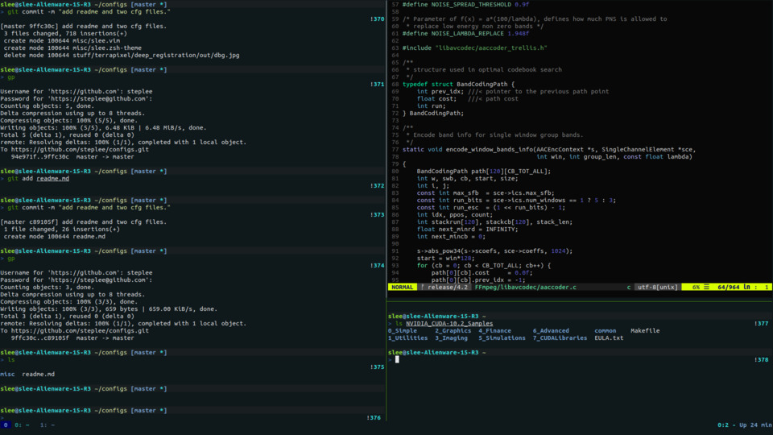

# Readme (July 2020)

### End Result


### Install

1. Install OS and git, vim, tmux, ipython, zsh, antigen, oh-my-zsh.
2. Clone this dir and copy all the dot files to the home directory.
3. Setup configurations:
- Vim
```
curl -fLo ~/.vim/autoload/plug.vim --create-dirs \
    https://raw.githubusercontent.com/junegunn/vim-plug/master/plug.vim

# Then
vim + :PluginInstall

# Then
cp misc/slee.vim ~/.vim/bundles/vim-colorschemes/colors/
```

- Zsh
```
chsh -s /usr/bin/zsh

cp misc/slee.zsh-theme ~/.antigen/repos/https-COLON--SLASH--SLASH-github.com-SLASH-robbyrussell-SLASH-oh-my-zsh.git/themes/
```


4. Setup SSH keys
